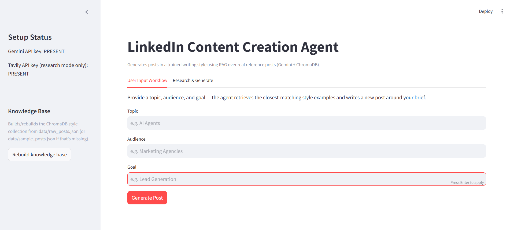
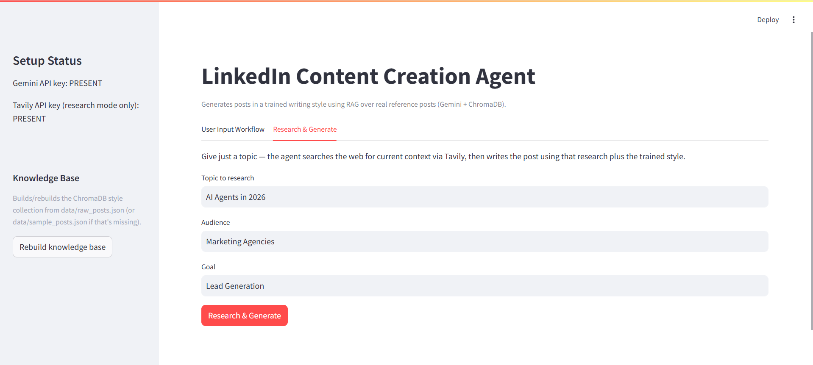
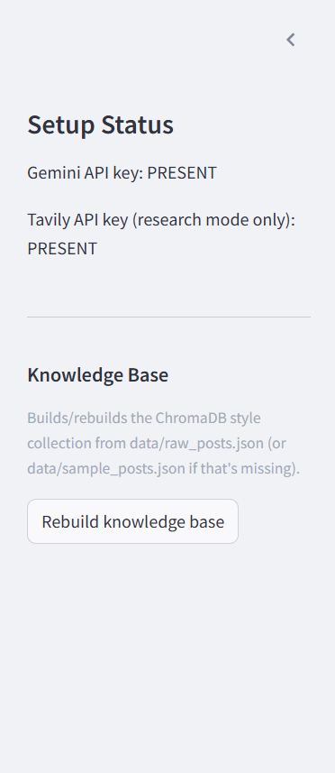

# LinkedIn Content Creation Agent

An AI agent that generates LinkedIn posts in a trained writing style. It uses **RAG (Retrieval-Augmented Generation)** over a corpus of real reference posts instead of fine-tuning — fully free-tier, fully local except for two API calls (Gemini + Tavily).

## Overview

Instead of fine-tuning a model on someone's writing (expensive, slow, and overkill for a style this distinctive), this agent:

1. Stores real reference posts locally and embeds them into a vector database (ChromaDB).
2. At generation time, retrieves the posts most relevant to the new topic.
3. Feeds those posts to Gemini as **style examples** inside the prompt, asking it to write something new in the same style.

it has two big advantages over fine-tuning for this use case: 
- it costs nothing beyond API calls
- the style updates instantly the moment you add a new reference post — no retraining required.

## Features

| Assignment requirement | Implemented as |
|---|---|
| Style training | `ingest.py` embeds reference posts into ChromaDB; retrieval happens at generation time |
| User Input Workflow | "User Input Workflow" tab in `app.py` — topic / audience / goal form |
| Auto-Research Workflow | "Research & Generate" tab — Tavily search feeds Gemini fresh context |
| Output: post, hook, body, CTA, hashtags | All returned as structured JSON, rendered separately in the UI |
| Bonus: image idea | `image_idea` field in every generation |
| Bonus: carousel idea + thumbnail text | `carousel_idea` and `thumbnail_text` fields |

## Architecture

```
                     ┌────────────────────┐
  (optional)         │  scrape_posts.py    │
  LinkedIn  ────────► │  (Playwright)      │
                     └─────────┬──────────┘
                               │ writes
                               ▼
                     data/raw_posts.json
                     (data/sample_posts.json
                      used as fallback)
                               │
                               ▼
                     ┌────────────────────┐
                     │     ingest.py       │   Gemini Embeddings
                     │  load → clean →     │ ◄───────────────────
                     │  embed → store      │
                     └─────────┬──────────┘
                               ▼
                        ┌─────────────┐
                        │  ChromaDB   │  (chroma_db/, persisted locally)
                        └──────┬──────┘
                               │ similarity_search()
                               ▼
                     ┌────────────────────┐    Tavily Search API
                     │  generate_post.py   │ ◄─── (Auto-Research mode only)
                     │  retrieve → prompt → │
                     │  Gemini → parse JSON │ ◄─── Gemini Chat
                     └─────────┬──────────┘
                               ▼
                     ┌────────────────────┐
                     │      app.py         │
                     │   (Streamlit UI)    │
                     └────────────────────┘
```

## Project Structure

```
linkedin-agent/
├── app.py                 # Streamlit UI — run this
├── config.py               # Centralized env var / path / model config
├── scrape_posts.py         # Optional: Playwright LinkedIn scraper
├── ingest.py                # Embeds posts into ChromaDB
├── generate_post.py        # Core RAG generation logic
├── requirements.txt
├── .env
├── data/
│   └── sample_posts.json   # Placeholder reference posts (see note below)
└── chroma_db/               # Created automatically by ingest.py
```

> **Important note on `data/sample_posts.json`:** For this proof of concept, the dataset contains manually collected LinkedIn posts from Nikit Bassi that are used as the style corpus for retrieval-augmented generation (RAG). These posts are not used to train or fine-tune a model. Instead, they are embedded using Gemini Embeddings and stored in ChromaDB. During generation, the system retrieves the most relevant posts and uses them as style references to help Gemini produce new LinkedIn content with a similar tone, structure, formatting, and writing style.
The dataset follows a simple JSON structure:

{
  "id": "nikit_001",
  "text": "LinkedIn post content",
  "topic": "AI automation",
  "likes": 0
}

For larger-scale deployments, additional posts can be added to the dataset and re-ingested into ChromaDB without retraining the system. This makes the approach significantly faster and more flexible than traditional model fine-tuning for small and frequently updated content collections.


## Getting Started

Follow the steps below to run the project locally.

### 1. Clone the Repository

```bash
git clone https://github.com/Pranshulx26/linkedin-agent
cd linkedin-agent
```

---

### 2. Create and Activate a Virtual Environment

This project was developed using **Python 3.11**. Python 3.10–3.12 should also work.

```bash
python -m venv .venv
```

Activate the environment:

**Windows**

```bash
.venv\Scripts\activate
```

**macOS / Linux**

```bash
source .venv/bin/activate
```

Once activated, you should see `(.venv)` at the beginning of your terminal prompt.

---

### 3. Install Dependencies

Install all required packages:

```bash
pip install -r requirements.txt
```

---

### 4. Install Playwright Browser (Optional)

This step is only required if you plan to use `scrape_posts.py` to collect LinkedIn posts automatically.

```bash
playwright install chromium
```

If you are using the provided dataset in `data/sample_posts.json`, you can skip this step.

---

### 5. Configure Environment Variables

Create a `.env` file from the provided template:

**Windows**

```bash
copy .env.example .env
```

**macOS / Linux**

```bash
cp .env.example .env
```

Open the `.env` file and add your API keys and configuration values.

Example:

```env
GEMINI_API_KEY=your_gemini_api_key
TAVILY_API_KEY=your_tavily_api_key

GEMINI_CHAT_MODEL=gemini-2.5-flash
GEMINI_EMBEDDING_MODEL=models/gemini-embedding-001
```

Instructions for obtaining the required API keys are provided below.

---

### 6. Prepare the Style Dataset

The project uses a collection of LinkedIn posts as the style reference dataset.

For this proof of concept, a manually curated dataset of Nikit Bassi's LinkedIn posts is included in:

```text
data/sample_posts.json
```

You can also replace this file with your own dataset using the same JSON structure.

---

### 7. Build the Vector Database

Before generating content, the posts must be converted into embeddings and stored in ChromaDB.

Run:

```bash
python ingest.py
```

This will:

* Load the reference posts
* Generate embeddings using Gemini
* Store them in ChromaDB
* Create the local vector database inside the `chroma_db/` directory

You only need to run this again when you add or modify posts in the dataset.

---

### 8. Launch the Application

Start the Streamlit interface:

```bash
streamlit run app.py
```

Once the server starts, open the URL shown in your terminal (usually `http://localhost:8501`).

---

### 9. Generate Content

Inside the application:

1. Enter a topic
2. Select a target audience
3. Specify a content goal
4. Click **Generate Post**

The system will:

* Retrieve relevant reference posts from ChromaDB
* Analyze their writing style
* Generate a new LinkedIn post using Gemini
* Provide hashtags, image ideas, carousel ideas, and thumbnail suggestions


## Getting Your API Keys

### Gemini API key (required, free tier)
1. Go to https://aistudio.google.com/app/apikey
2. Sign in with a Google account.
3. Click "Create API key" and copy it into `GEMINI_API_KEY` in your `.env` file.

### Tavily API key (required only for Research & Generate mode, free tier)
1. Go to https://app.tavily.com/
2. Sign up for a free account.
3. Copy your API key from the dashboard into `TAVILY_API_KEY` in your `.env` file.


### (Optional) Step 0 — Scrape real reference posts first
```bash
python scrape_posts.py
```
Requires `LINKEDIN_EMAIL`, `LINKEDIN_PASSWORD`, and `LINKEDIN_PROFILE_URL` in `.env`. **Read the warning at the top of `scrape_posts.py` before running this** — LinkedIn's ToS prohibit automated scraping, and this should only be run against an account you own or have explicit permission to automate, at low volume.

## Screenshots

### User Input Workflow 



### Research WOrkflow



### Sidebar (Rebuild Knowledge Base)



## Future Improvements 

- Multi-author style profiles (swap between different trained styles)
- A feedback loop where the user edits a generated post and that edit is stored as a new high-quality reference example
- Sentiment/engagement scoring on reference posts so retrieval favors a person's best-performing style, not just their most topically similar post
- Batch generation (generate 5 post variants at once and let the user pick)

---

## One-Week Improvements Plan

If I had an additional week to continue developing this project beyond the proof of concept, these are the features I would add.

### 1. LinkedIn Auto-Posting

**Feature:** Publish generated posts directly to LinkedIn from the application.

**Tech Stack:** LinkedIn API, Python, Streamlit

**Implementation Approach:**
After generating a post, users could click a "Publish" button inside the application. The system would connect to LinkedIn through its API and post the approved content directly to the user's account. This would remove the need to manually copy and paste content.

---

### 2. Content Calendar

**Feature:** Schedule posts for future dates.

**Tech Stack:** Streamlit, SQLite, Google Calendar API

**Implementation Approach:**
Users could save generated posts and assign a date and time for publishing. Scheduled posts would be stored in a database and displayed in a simple calendar view. This would help users plan content ahead of time and maintain a consistent posting schedule.

---

### 3. Analytics Dashboard

**Feature:** Track post performance.

**Tech Stack:** Streamlit, Plotly, SQLite

**Implementation Approach:**
After a post is published, engagement metrics such as likes, comments, and shares could be stored and displayed inside a dashboard. Users would be able to see which topics perform best and use those insights when creating future content.

---

### 4. Multi-Platform Content Generation

**Feature:** Generate content for multiple social media platforms.

**Tech Stack:** Gemini API, Python

**Implementation Approach:**
Instead of generating only LinkedIn posts, users could choose a platform such as X (Twitter), Instagram, or Facebook. The system would adapt the content length, format, and writing style for the selected platform while keeping the original message consistent.

---

### 5. A/B Testing

**Feature:** Generate multiple versions of the same post and compare performance.

**Tech Stack:** Gemini API, SQLite

**Implementation Approach:**
The system could generate two different versions of a post with different hooks or calls-to-action. After publishing, engagement metrics could be compared to determine which version performs better. This would help improve future content generation and audience engagement.
